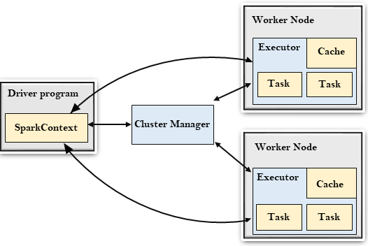

# PySpark Notes

## 1. Spark

Apache Spark is an open-source, distributed computing system designed for fast and general-purpose data processing.

### Spark Architecture

The Apache Spark Architecture is designed for distributed and parallel data processing. It uses a master-slave architecture with a driver program coordinating the tasks and worker nodes executing them.

**Key Components:**
1. **Driver Program**
   - The **Driver** is the process that runs the main function of the Spark application.
   - It is responsible for coordinating the execution of the tasks across the cluster.
   - The driver maintains information about the Spark application and the **cluster’s resources**.
   - It also schedules jobs and tracks their execution.

2. **Cluster Manager**
   - The **Cluster Manager** is responsible for managing resources in the cluster.
   - Spark supports multiple cluster managers such as:
     - **Standalone** (default mode)
     - **YARN** (Hadoop resource manager)
     - **Mesos** (cluster manager, now deprecated)
     - **Kubernetes** (platform for managing conatinerized apps)
   - It allocates resources to the Spark application and assigns tasks to worker nodes.

3. **Worker Nodes**
   - **Worker Nodes** are the nodes in the cluster that run the Spark tasks.
   - Each worker node runs one or more executors, which are responsible for executing code assigned to them.
   - A worker node communicates with the cluster manager to request resources.

4. **Executor**
   - An **Executor** is a distributed agent responsible for executing tasks in a Spark application.
   - Each Spark job runs in its own executor, and each executor has its own memory and disk storage.
   - Executors run on worker nodes and are responsible for storing RDDs (Resilient Distributed Datasets) and performing computations.
   - Executors only run for the lifetime of a Spark application, and once the application finishes, the executor is shut down.



**Additional components**
1. **Task**
   - A **Task** is a unit of work in Spark.
   - Tasks are the smallest unit of work, and each task is executed on a single partition of the data.
   - Tasks are bundled into **jobs** and executed in parallel across multiple executors in the cluster.

2. **Job**
   - A **Job** is triggered by an action (e.g., `collect()`, `count()`, etc.) in a Spark application.
   - Jobs consist of multiple stages, and each stage corresponds to a set of tasks that can be executed in parallel.

3. **Stage**
   - A **Stage** is a group of tasks that can be executed in parallel.
   - Stages are created based on the transformations in the RDD lineage, which are divided by shuffling operations (like `groupBy` or `join`).
   - Spark determines the stages in the job through a **DAG (Directed Acyclic Graph)**.

4. **DAG (Directed Acyclic Graph)**
   - The **DAG** is a data structure that represents the computation of a Spark job.
   - Spark builds the DAG by examining the transformations in the RDD lineage.
   - It is responsible for determining the stages and scheduling tasks in the right order.

### Spark Execution Flow

1. **Job Submission**:
   - The **Driver Program** triggers the job by invoking an action (e.g., `collect()` or `count()`).
   - The job is submitted to the **Cluster Manager** for resource allocation.

2. **Resource Allocation**:
   - The **Cluster Manager** allocates resources (e.g., CPU, memory) to worker nodes for job execution.

3. **Stage Creation & DAG Generation**:
   - The **Driver** breaks the job into stages, creating a **DAG** of tasks.
   - The **DAG Scheduler** analyzes the job’s RDD lineage and splits it into stages based on dependencies.

4. **Task Scheduling**:
   - The **DAG Scheduler** schedules tasks in parallel across available **Executors** on worker nodes, respecting dependencies.

5. **Task Execution**:
   - **Executors** process tasks, compute results, and return them to the Driver.

6. **Stage Completion**:
   - Once tasks in a stage are completed, the DAG Scheduler proceeds to the next stage, handling any necessary data shuffling.

7. **Job Completion**:
   - The **Driver** collects the final results after all stages are executed.
   - The driver aggregates results and returns them to the user.

8. **Resource Release**:
   - The **Cluster Manager** releases resources, and the job finishes.


### Spark v. Hadoop
- Hadoop is an open-source framework designed for distributed storage and processing of large-scale data across clusters. It comprises two core components: HDFS (Hadoop Distributed File System) for data storage and MapReduce for parallel batch processing.

- Spark is not a direct replacement for Hadoop as a whole, but it **acts as an alternative to Hadoop’s MapReduce engine** for faster, more flexible data processing.


| **Aspect**                | **MapReduce (Hadoop)**                                     | **Spark**                                                         |
|---------------------------|----------------------------------------------------------|-------------------------------------------------------------------|
| **Processing Model**      | Batch processing only.                                    | Batch processing, real-time streaming, interactive queries, and machine learning. |
| **Execution**             | Disk-based; reads and writes data between each Map and Reduce stage. | In-memory computation for intermediate results; falls back to disk if memory is insufficient. |
| **Speed**                 | Slower due to heavy disk I/O between stages.              | Significantly faster (up to 100x for certain tasks) because of in-memory operations. |
| **Ease of Use**           | Requires complex Java-based programming for MapReduce tasks. | High-level APIs in Python, Scala, Java, R, and SQL support for simplicity. |
| **Fault Tolerance**       | Achieved through HDFS replication.                        | Achieved using RDD lineage; lost partitions are recomputed.       |
| **Streaming Support**     | Not supported natively (requires tools like Kafka). | Built-in streaming support with **Spark Streaming**.              |
| **Machine Learning**      | Limited support through Apache Mahout.                   | Rich machine learning library (**MLlib**) for advanced analytics. |
| **Iteration Support**     | Poor; each iteration reads and writes from disk.          | Excellent; iterative algorithms are much faster due to in-memory data storage. |
| **Resource Management**   | Relies on YARN for resource management.                   | Works with YARN, Mesos, or standalone cluster managers.           |
| **Latency**               | High latency due to disk I/O between Map and Reduce phases. | Low latency due to in-memory computation.                         |
| **Scalability**           | Highly scalable for batch jobs across large datasets.     | Equally scalable but more resource-efficient for iterative tasks. |
| **Community & Ecosystem** | Mature, with established tools like Hive, Pig, and HBase. | Rapidly growing with a wide range of libraries (MLlib, Spark SQL, etc.). |

- Spark is storage-agnostic, meaning it can connect to a variety of storage backends (including HDFS), depending on the application's requirements and the infrastructure in use.

- How they complement each other: 
   Spark, being a distributed computing framework designed for fast, in-memory data processing, can use Hadoop’s HDFS for storage, and YARN (Hadoop’s resource manager) for resource scheduling.


## 2. What is PySpark?
- **PySpark** is the Python API for Apache Spark, an open-source, distributed computing system. 
- Spark is by default written in Scala, which is written in Java. Pyspark provides a python interface to access spark.
- It enables large-scale data processing and machine learning tasks using Python.
- PySpark supports:
  - Batch Processing
  - Real-time Streaming
  - SQL Queries
  - Graph Processing
  - Machine Learning

### PySpark Architexture

1. **SparkContext**
   - **Definition**: The initial entry point for a PySpark application, managing the connection to the Spark cluster.
   - **Functionality**: It initializes Spark, manages resources, and coordinates the distribution of tasks across the cluster. It also provides methods for creating RDDs (Resilient Distributed Datasets).

2. **SparkSession**
   - **Definition**: A unified entry point for working with Spark in PySpark.
   - **Functionality**: SparkSession simplifies the interaction with Spark's core features, including SQL queries, DataFrames, and RDDs. It encapsulates the `SparkContext` and allows access to a variety of data sources and operations.

3. **Spark Core**
   - **Definition**: Spark Core is the underlying engine that powers the entire Apache Spark framework. It provides the basic functionalities needed for distributed data processing and is responsible for managing the fundamental operations of Spark.
   - **Functionality**: Spark Core provides the essential components for distributed data processing, task scheduling, fault tolerance, and resource management.

4. **RDD (Resilient Distributed Dataset)**
   - **Definition**: The fundamental data structure in Spark, representing a distributed collection of objects.
   - **Functionality**: RDDs enable fault-tolerant, parallel processing of large datasets. They can be transformed through operations like `map()`, `filter()`, and `reduce()`, and support in-memory computation.

5. **DataFrame**
   - **Definition**: A higher-level abstraction built on top of RDDs, offering a distributed collection of data organized into named columns.
   - **Functionality**: DataFrames are optimized through the Catalyst query optimizer and allow for efficient handling of structured data. They provide an SQL-like interface, enabling powerful querying and data manipulation.

Additionally, Pyspark has an important feature known as **Shuffling**
   - **Definition**: The process of redistributing data across partitions during operations that require data from multiple nodes.
   - **Functionality**: Shuffling occurs during operations like `groupBy()`, `join()`, and `reduceByKey()`, where data is re-organized across the cluster to satisfy dependencies. While it enables complex data transformations, shuffling is an expensive operation that can impact performance due to network and disk I/O.

### PySpark (and Spark) Modules

1. **Spark SQL**
   - **Definition**: A module that allows you to run SQL queries on structured data.
   - **Functionality**: Spark SQL can query DataFrames and RDDs using SQL syntax, integrate with Hive for data storage and querying, and optimize query execution. It supports complex SQL queries like `JOIN`, `GROUP BY`, and subqueries.

2. **MLlib (Machine Learning Library)**
   - **Definition**: Spark’s library for machine learning algorithms.
   - **Functionality**: MLlib provides scalable algorithms for classification, regression, clustering, and collaborative filtering. It also includes tools for feature extraction, model evaluation, and data preprocessing, enabling distributed machine learning on large datasets.

3. **Spark Streaming**
   - **Definition**: A component for processing real-time data streams.
   - **Functionality**: Spark Streaming processes data in micro-batches, allowing real-time analytics on data from sources like Kafka, Flume, or file systems. It supports windowing, stateful operations, and time-based processing.

4. **GraphX**
   - **Definition**: Spark’s library for graph processing and analytics.
   - **Functionality**: GraphX enables graph-parallel computation, which allows for efficient analysis of graph data like social networks, including algorithms like PageRank and connected components. It's primarily designed for use with Scala/Java but can be used with RDDs in PySpark.

## 3. RDD (Resilient Distributed Dataset)
### What is RDD?
An RDD (Resilient Distributed Dataset) is a fundamental data structure in Apache Spark, representing a distributed collection of data that can be processed in parallel across multiple nodes in a cluster. It is immutable, fault-tolerant, and provides a way to store and process large-scale data across a distributed environment.

RDDs form the backbone of Spark’s distributed processing, enabling parallel computation, in-memory processing, and fault tolerance.

### Features of RDDs

1. **Immutable**
   - Once created, an RDD cannot be modified. Any transformation on an RDD results in the creation of a new RDD, preserving the original dataset.
2. **Distributed**
   - RDDs are split into partitions, with each partition being processed independently on different nodes in the cluster. This allows parallel processing of large datasets.
3. **Fault-Tolerant**
   - RDDs can recover lost data from failed nodes using lineage information, which tracks the sequence of transformations that created the RDD. If a partition is lost, Spark can recompute the lost data from the original source.
4. **Lazy Evaluation**
   - Transformations on RDDs (like map(), filter(), flatMap(), etc.) are lazily evaluated. This means that Spark does not perform the computation immediately but rather builds an execution plan. Computation only happens when an action (e.g., collect(), count(), save()) is triggered.
5. **In-Memory Computation**:
   - RDDs enable in-memory computation, allowing for faster data processing by keeping intermediate data in memory instead of writing to disk.
6. **Transformations and Actions**:
   - **Transformations**: Operations that produce new RDDs from existing ones (e.g., map(), filter(), flatMap()). Transformations are lazily evaluated and do not trigger execution immediately.
   - **Actions**: Operations that return a result to the driver or write data to storage (e.g., collect(), count(), save()). Actions trigger the execution of the transformations and computations.

### Creating RDDs
1. **Parallelizing a Collection**:
   ```python
   rdd = spark.sparkContext.parallelize([1, 2, 3, 4, 5])
   ```
2. **From External Data**:
   ```python
   rdd = spark.sparkContext.textFile("path/to/file.txt")
   ```
3. **From Existing RDDs**:
   ```python
   rdd = rdd.map(lambda x: x * 2)
   ```

### RDD Transformations
- **Transformations** return a new RDD and are lazy.
- Common transformations:
  - `map()`: Apply a function to each element.
  - `filter()`: Select elements based on a condition.
  - `flatMap()`: Flatten nested collections.
  - `distinct()`: Remove duplicates.
  - `union()`: Combine two RDDs.

### RDD Actions
- **Actions** trigger computation and return results.
- Common actions:
  - `collect()`: Return all elements.
  - `count()`: Count the elements.
  - `first()`: Return the first element.
  - `reduce()`: Aggregate elements using a function.
  - `saveAsTextFile()`: Save RDD data to a text file.


## 4. DataFrames
### What is a DataFrame?
A DataFrame in PySpark is a distributed collection of data organized into named columns, similar to a table in a relational database or a data frame in R/Pandas. DataFrames provide a higher-level abstraction over RDDs (Resilient Distributed Datasets) for processing structured data, allowing for efficient querying and transformation. They are built on top of RDDs and leverage Spark’s Catalyst optimizer for query optimization and performance improvement.

DataFrames offer better performance than RDDs, especially for complex queries and operations, due to the Catalyst optimizer and the ability to perform SQL-like operations. They are the preferred API for working with structured and semi-structured data in Spark.

### Creating DataFrames
1. **From RDDs**:
   ```python
   from pyspark.sql import Row
   rdd = spark.sparkContext.parallelize([Row(name="Alice", age=25), Row(name="Bob", age=30)])
   df = spark.createDataFrame(rdd)
   ```
2. **From CSV/JSON/Parquet Files**:
   ```python
   df = spark.read.csv("path/to/file.csv", header=True, inferSchema=True)
   ```
3. **From Pandas**:
   ```python
   import pandas as pd
   pdf = pd.DataFrame({'name': ['Alice', 'Bob'], 'age': [25, 30]})
   df = spark.createDataFrame(pdf)
   ```

### RDDs vs DataFrames:
- **RDDs** are more low-level, giving you control over data processing but requiring more effort in terms of optimization.
- **DataFrames** are built on top of RDDs and provide a higher-level abstraction, optimized through Spark's Catalyst query optimizer. DataFrames offer better performance for structured data processing and allow the use of SQL queries.


## 5. Partitioning in PySpark
### What is a Partitioning?
Partitioning in PySpark refers to the process of dividing the data into smaller, manageable chunks or partitions across the nodes in a Spark cluster. These partitions are the units of parallelism in Spark. Each partition is a subset of the data, and Spark processes these partitions in parallel across the cluster's worker nodes. Proper partitioning can lead to improved performance by optimizing data processing and reducing shuffle operations.

### Key concepts of Partitioning
1. **Data Partitioning**
    - Spark divides large datasets into smaller partitions that can be processed in parallel on different worker nodes.
    - Each partition corresponds to a block of data stored in memory or on disk, and Spark computes on these partitions independently during transformations and actions.
2. **Default Partitioning**
   - When you create an RDD or DataFrame, Spark decides the default number of partitions based on factors like the number of cores available and the size of the data.
   - The default partitioning might not always be optimal, and in some cases, you may need to adjust the number of partitions based on your workload and available resources.
3. **Custom Partitioning**
   - You can control the partitioning of your RDDs or DataFrames by specifying the number of partitions or using custom partitioning strategies to achieve better performance.
4. **Shuffle and Repartitioning**:
   - **Shuffling**: is a process that redistributes data across partitions, which is necessary for operations that require data from multiple partitions but is typically more costly and slower due to network and disk operations. Used for operations like groupBy(), join(), or reduceByKey(). Shuffling is an expensive operation because it involves disk I/O and network communication.
   - **Repartitioning**: The process of changing the number of partitions of a DataFrame or RDD. This can be done using the repartition() or coalesce() methods.

### Types of Partitioning
1. **Hash Partitioning**
   - This is the default partitioning strategy for most operations in Spark. Data is distributed across partitions based on a hash function applied to the key (for RDDs that contain key-value pairs).
   - Example: In reduceByKey(), Spark applies hash partitioning to ensure that the same keys end up in the same partition.
2. **Range Partitioning**
   - Range partitioning involves partitioning the data based on a specific range of values. It is often used when the data is sorted, ensuring that the partitions cover distinct ranges of data.
   - Example: In a sorted dataset, range partitioning would ensure that records with values from 0-100 go to one partition, 101-200 to another, and so on.
3. **Custom Partitioning**
   - Spark allows you to define custom partitioning strategies based on your needs, such as partitioning data according to specific columns or conditions.

### How to Partition
**`repartition()`**: <br>
- The repartition() method allows you to increase or decrease the number of partitions in an RDD or DataFrame. This operation involves a full shuffle of the data across the cluster.
- Use case: When you need to increase or decrease the number of partitions for efficient processing.
```python
df = df.repartition(10)  # Repartition DataFrame into 10 partitions
```

**`coalesce()`**: <br>
- The coalesce() method reduces the number of partitions, typically used when you want to decrease the number of partitions after filtering or other operations. Unlike repartition(), coalesce() performs a narrow transformation (no shuffle), making it more efficient.
- Use case: When reducing the number of partitions after filtering data or performing operations that result in fewer partitions.
```python
df = df.coalesce(3)  # Reduce to 3 partitions (no shuffle)
```
**`partitionBy()`**: <br>
- For RDDs that involve key-value pairs, the partitionBy() method can be used to partition the data based on a specific number of partitions and a custom partitioning function.
- Use case: When you need to partition data based on keys or custom logic.
```python
rdd = rdd.partitionBy(5)  # Partition RDD into 5 partitions
```

<br>
Partitioning in PySpark improves performance by enabling parallel processing of data across multiple nodes. It ensures better load balancing, prevents data skew, and optimizes memory usage. By reducing the overhead of shuffling data, partitioning also speeds up operations like joins and groupings. Proper partitioning strategies help optimize Spark job performance and reduce processing time and cost, especially when dealing with large datasets.

## 6. Lineage in PySpark
In PySpark, lineage refers to the sequence of operations (transformations) that Spark applies to a dataset due to Lazy Evaluation. It is a critical feature for fault tolerance and recovering lost data. However, in certain situations, breaking or detaching the lineage of a DataFrame or RDD can be useful for improving performance, reducing memory usage, or preventing unnecessary recomputation.

Lineage can be broken by materializing the DataFrame or RDD into a physical form, such as storing it on disk (in formats like Parquet, CSV, etc.) or caching it in memory. Once a DataFrame is materialized, its transformations are no longer required to be recomputed in the event of a failure or when it is accessed again.

### How to Break Lineage
1. **Caching or Persisting Data** <br>
- Caching or persisting a DataFrame or RDD stores it in memory or on disk, which breaks the lineage. After caching, Spark no longer needs to recompute the transformations applied to the dataset each time it is accessed.
- `cache()` is simply a shortcut for persist() with the default storage level of MEMORY_AND_DISK. It is useful for caching data that fits in memory but also allows overflow to disk if necessary.
```python
# Cache the DataFrame to break lineage
df_transformed.cache()

# Perform actions to trigger computation
df_transformed.show()
```
- `persist()` provides more control by allowing you to choose different storage levels (e.g., memory only, disk only, or off-heap) based on the size of the data and performance needs.

```python
# Cache the DataFrame to break lineage
df_transformed.persist()

# Perform actions to trigger computation
df_transformed.show()
```
<br>

2. **Writing Data to Disk or External Sotrage**<br>
- When you write a DataFrame or RDD to disk (in formats like Parquet, CSV, or JSON) or external storage, Spark materializes the dataset and effectively breaks the lineage
```python
df_transformed.write.parquet("path/to/output")
```
<br>

3. **Using `collect()` to Trigger Computation**
- The `.collect()` method retrieves the data from the distributed cluster and brings it to the local driver. Once the data is collected, the lineage is broken because the transformations are no longer needed to be recomputed in Spark. 
- However, this should be used cautiously because collecting large datasets to the driver can cause memory issues.
```python
# Triggering computation and breaking lineage
data_collected = df_transformed.collect()
```


## 7. Spark SQL
Spark SQL is a module in Apache Spark for structured data processing. It provides an interface for querying data via SQL and works with both DataFrames and Datasets.

- It provides support for various data formats (Parquet, CSV, JSON, etc.) and integrates well with Spark’s DataFrames and Datasets.
- Optimized query execution:
   - Spark SQL uses a **Catalyst Optimizer**, which optimizes query plans to enhance performance. This includes query optimization techniques like predicate pushdown, column pruning, and join optimizations.
   - Spark SQL also supports **Tungsten**, an execution engine that provides memory management and code generation for enhanced performance.
- You can interact with Spark SQL through both SQL queries (spark.sql()) and DataFrame API operations.
- Spark SQL can interact with Apache Hive, allowing users to execute HiveQL queries and access Hive data warehouses. It provides integration with Hive's metastore, enabling users to use existing Hive tables directly in Spark.

### SQLContext
**SQLContext** is an entry point for working with structured data in Apache Spark. It provides a programming interface to interact with Spark's SQL module and helps you execute SQL queries, access DataFrames, and manage tables.

In PySpark, SQLContext was originally used as the main entry point for Spark SQL, but with the introduction of SparkSession in Spark 2.0, SQLContext is now considered legacy. **SparkSession** combines all the functionality of SQLContext and HiveContext, and it is recommended to use SparkSession going forward.

### Using SQL with DataFrames
1. **Creating a DataFrame from a SQL Query**:
   ```python
   df = spark.sql("SELECT * FROM my_table WHERE age > 25")
   ```
2. **Register DataFrame as a Temporary Table**:<br>
Spark SQL allows you to create temporary views of DataFrames. These views behave like tables in SQL and can be queried using SQL statements. These are session-specific and are dropped when the session ends.
   ```python
   df.createOrReplaceTempView("people")
   ```
3. **Run SQL Queries**:
   ```python
   result = spark.sql("SELECT name, age FROM people WHERE age > 25")
   result.show()
   ```

## 8. Machine Learning with MLlib

MLlib in PySpark is a machine learning library built on top of Apache Spark that provides scalable machine learning algorithms and tools for large-scale data analysis. 

### Key Features of MLlib

1. **Scalable Algorithms**: 
- MLlib includes implementations of popular machine learning algorithms that are optimized for large-scale data, including:
   - Classification: Logistic Regression, Naive Bayes, Decision Trees, Random Forest, etc.
   - Regression: Linear Regression, Generalized Linear Models (GLM), etc.
   - Clustering: K-Means, Gaussian Mixture Model (GMM), etc.
   - Collaborative Filtering: Alternating Least Squares (ALS) for matrix factorization-based recommendation.
   - Dimensionality Reduction: Principal Component Analysis (PCA), Singular Value Decomposition (SVD), etc.

2. **Data Handling**: 
- MLlib works with DataFrames and RDDs (Resilient Distributed Datasets), providing flexibility in terms of input data formats. While MLlib originally worked with RDDs, it has evolved to focus more on DataFrames for better performance and ease of use.

3. **Pipelines**: 
- MLlib supports the Pipeline API, which allows you to build complex workflows by combining multiple stages of processing (e.g., data transformation, model training, and evaluation) into a single pipeline.

4. **Feature Extraction and Transformation**: 
- MLlib provides tools for feature extraction, transformation, and scaling, such as:
   - StandardScaler: For feature scaling.
   - VectorAssembler: For combining features into a single vector.
   - StringIndexer: For converting categorical values into numerical indices.
   - OneHotEncoder: For one-hot encoding categorical variables.

5. **Model Evaluation**: 
- MLlib provides various evaluation metrics like accuracy, precision, recall, F1 score, etc., for assessing the performance of machine learning models.

6. **Cross-Validation**: 
- MLlib supports cross-validation and hyperparameter tuning to improve model accuracy and prevent overfitting.


## 9. PySpark Streaming
### Basics of Spark Streaming
- Real-time processing of streaming data using micro-batches.
- Data can be ingested from sources like Kafka, HDFS, sockets, etc.

### Example: Word Count from a Socket Stream
```python
from pyspark.streaming import StreamingContext

ssc = StreamingContext(spark.sparkContext, batchDuration=1)
lines = ssc.socketTextStream("localhost", 9999)
words = lines.flatMap(lambda line: line.split(" "))
wordCounts = words.map(lambda word: (word, 1)).reduceByKey(lambda a, b: a + b)
wordCounts.pprint()

ssc.start()
ssc.awaitTermination()
```

## 10. Most Used PySpark Commands

| **Category**               | **Command**                          | **Description**                                                                 |
|----------------------------|--------------------------------------|---------------------------------------------------------------------------------|
| **Session Creation**        | `spark = SparkSession. \` <br> `builder.appName("AppName"). \` <br>`getOrCreate()` | Creates or retrieves an existing Spark session.                                 |
| **DataFrame Operations**    | `df = spark.createDataFrame([])`  | Creates a DataFrame from a list or collection.                                  |
|                            | `df.show(n)`                        | Displays the first `n` rows of the DataFrame.                                   |
|                            | `df.collect()`                      | Returns all rows of the DataFrame as a list of Row objects.                     |
|                            | `df.count()`                        | Returns the number of rows in the DataFrame.                                    |
|                            | `df.first()`                        | Returns the first row of the DataFrame.                                         |
|                            | `df.select(columns)`                | Selects specific columns from the DataFrame.                                    |
|                            | `df.filter(condition)`              | Filters rows based on a condition.                                              |
|                            | `df.withColumn("new_col", expr)`    | Adds or modifies a column in the DataFrame.                                     |
|                            | `df.groupBy("column").agg(...)`     | Groups the data by a column and applies aggregation functions.                  |
|                            | `df.orderBy("column")`             | Sorts the DataFrame by one or more columns.                                     |
|                            | `df.distinct()`                     | Removes duplicate rows from the DataFrame.                                      |
|                            | `df.createOrReplaceTempView("view")` | Registers a DataFrame as a temporary SQL view.                                   |
|                            | `spark.sql("SELECT * FROM view")` | Executes an SQL query on the registered temporary view.                          |
| **File Operations**         | `spark.read.csv("path")`            | Reads a CSV file into a DataFrame.                                              |
|                            | `spark.read.json("path")`           | Reads a JSON file into a DataFrame.                                             |
|                            | `spark.read.parquet("path")`        | Reads a Parquet file into a DataFrame.                                          |
|                            | `df.write.csv("path")`              | Writes a DataFrame to a CSV file.                                               |
|                            | `df.write.json("path")`             | Writes a DataFrame to a JSON file.                                              |
|                            | `df.write.parquet("path")`          | Writes a DataFrame to a Parquet file.                                           |
| **Caching & Persistence**   | `df.cache()`                        | Caches a DataFrame in memory (with fallback to disk).                           |
|                            | `df.persist(StorageLevel)`          | Persists a DataFrame with a custom storage level.                               |
| **Repartitioning**          | `df.repartition(n)`                 | Repartitions the DataFrame into `n` partitions.                                |
|                            | `df.coalesce(n)`                    | Merges multiple partitions into `n` partitions.                                |
| **SQL Commands**            | `spark.sql("SELECT * FROM table")`  | Executes SQL queries on DataFrame views.                                        |
| **Actions**                 | `df.show()`                         | Displays the first 20 rows of the DataFrame.                                    |
|                            | `df.explain()`                      | Displays the physical and logical plan of the DataFrame.                       |
| **Broadcasting**            | `broadcast(df)`                     | Broadcasts a DataFrame to all worker nodes (optimizes joins).                   |


## 10. Tips and Best Practices
1. **Optimize Transformations**:
   - Minimize shuffles by using operations like `reduceByKey` instead of `groupByKey`.
2. **Persist RDDs/DataFrames**:
   - Use `.persist()` or `.cache()` for frequently accessed data.
3. **Partitioning**:
   - Tune the number of partitions for efficient processing using `.repartition()` or `.coalesce()`.
4. **Broadcast Variables**:
   - Use `sc.broadcast()` for read-only data shared across nodes.
5. **Accumulators**:
   - Use `sc.accumulator()` for aggregating values during execution.

## 11. PySpark Ecosystem
- **Cluster Managers**: YARN, Mesos, Kubernetes, Standalone.
- **Data Sources**: HDFS, S3, Kafka, Cassandra, Hive, JDBC.
- **Supported Languages**: Python, Java, Scala, R.
